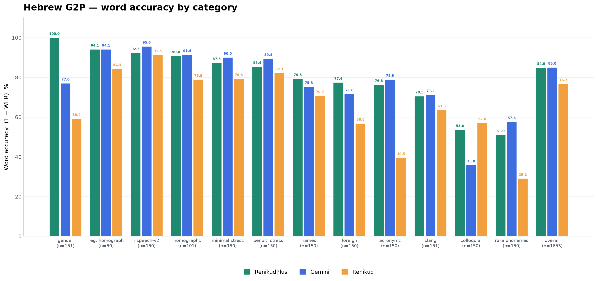

# ReNikud Plus — Hebrew Grapheme-to-Phoneme Inference

Convert unvocalized Hebrew text into IPA for TTS, speech technology, and
spoken-language research.

## Benchmark



## Install

**From PyPI:**

```console
pip install renikud-plus
```

**From this repo (no PyPI):**

```console
uv sync
```

Then run the example:

```console
uv run python examples/basic.py
```

The ONNX weights (~310 MB) download automatically from Hugging Face on first
use and are cached locally. No separate `hf download` step is required.

## Usage

```python
from renikud_onnx import G2P

g2p = G2P()  # downloads notmax123/RenikudPlus model.onnx if needed
print(g2p.phonemize("שלום עולם"))
# → ʃlˈom ʔolˈam
```

Pass a local path if you already have the weights:

```python
g2p = G2P("model.onnx")
```

For a gender-conditioned ONNX model, pass `speaker` and `target_speaker` as
`0` (unknown), `1` (male), or `2` (female):

```python
g2p.phonemize("היא רצה", speaker=2, target_speaker=2)
```

### Niqqud output

`vocalize` renders the same predictions as pointed Hebrew (niqqud) instead of
IPA — for TTS engines that read niqqud natively but ignore phoneme markup. It
accepts the same `speaker` / `target_speaker` arguments.

```python
print(g2p.vocalize("שלום עולם"))
# → שׁלוֹם עוֹלַם
```

Niqqud has no stress mark, so predicted stress is not represented in this output
(it is in `phonemize`). Diacritization is phonetically faithful but not
publication-grade — e.g. shva in clusters is omitted.


## Citation

```bibtex
@misc{melichov2026renikud,
  title={ReNikud: Audio-Supervised Hebrew Grapheme-to-Phoneme Conversion},
  author={Maxim Melichov and Yakov Kolani and Morris Alper},
  year={2026},
  url={https://arxiv.org/pdf/2606.20179},
}
```
